<!--
████████████████████████████████████████████████████████████
  RAJAT DEY — GitHub Profile README
  AI/ML Engineer | Full Stack Engineer | Founder @ Nexero
  GitHub: Whitedevil00101
████████████████████████████████████████████████████████████
-->

<div align="center">

<!-- ═══════════════════════════════════════════════════════ -->
<!--              ANIMATED HEADER BANNER                    -->
<!-- ═══════════════════════════════════════════════════════ -->



<!-- Animated Typing Role Banner -->


<br/>

<!-- Social Badges -->
[](https://github.com/Whitedevil00101)
[](https://linkedin.com/in/rajatdey)
[](mailto:rajat.dey00101@gmail.com)
[](tel:+918974814515)
[](https://maps.google.com/?q=Vadodara,Gujarat)

<br/>


[](https://github.com/Whitedevil00101)

</div>

---

## 🧠 Professional Summary


```yaml
Name       : Rajat Dey
Role       : AI/ML Engineer | Full Stack Engineer
Location   : Vadodara, Gujarat, India
Education  : BCA (Hons) AI/ML — Parul University (2024–2028)
Focus      : Cost-efficient, high-impact AI & software systems

Strengths  :
  - Architecting AI pipelines under constrained budgets
  - Hybrid Deep Learning: CNN + RNN + CTC architectures
  - Full-Stack delivery (Laravel, React, Go, PHP, Python)
  - 90%+ cost reduction vs market on every project delivered

Status     : Open to SDE | AI/ML | Research Roles
```

<br clear="right"/>


---

## 🛠️ Technical Skills

### 🤖 AI / ML


**Classical ML:** XGBoost · Random Forest · SVM · Isolation Forest · K-Means · DBSCAN  
**Deep Learning:** CNN (EfficientNet-B3, ResNet-50) · RNN (BiLSTM) · CTC · Hybrid Models  
**Specializations:** Computer Vision (ICR/OCR, Object Detection) · NLP · End-to-End ML Pipelines

### 🖥️ Backend & Full Stack


### ☁️ Cloud, Databases & DevOps


---

## 🚀 Featured Projects

<table>
<tr>
<td width="50%" valign="top">

### 🔤 Gujarati ICR System *(Ongoing — 2026)*


Architecting a **hybrid deep learning ICR system** combining EfficientNet-B3 (visual features) with BiLSTM/CTC (sequence decoding) on a 1.6M character dataset.

- 🎯 Target: **>97% accuracy** baseline
- 🔁 End-to-end pipeline: preprocessing → training → inference
- 🧩 Hybrid architecture: CNN + RNN + CTC

**Stack:** Python · EfficientNet-B3 · BiLSTM · CTC · OpenCV

</td>
<td width="50%" valign="top">

### 🛡️ Anti-Drone Gun System *(NFSU/BSF — 2023-24)*


Independently architected a **multi-frequency RF jamming system** targeting 2.4GHz, GPS, and Bluetooth for defense-grade drone neutralization.

- 💰 Designed at **<₹1L** (~90% cost reduction vs market)
- 🏆 **Vadodara Hackathon 5.0 — Top 5 Team Lead**
- 🎯 Scalable deployment architecture for field use

**Stack:** RF Systems · Computer Vision · Hardware Design

</td>
</tr>
<tr>
<td width="50%" valign="top">

### 🚗 ADAS Vehicle Planning *(NFU — 2023-24)*


Led system planning in a **4-member team** to architect a cost-optimized ADAS hardware stack for autonomous vehicle assistance.

- 💰 Reduced projected cost to **<₹10L** (70% below market)
- 🧠 Sensor fusion + real-time CV pipeline design
- 📐 Full hardware + software co-architecture

**Stack:** Computer Vision · Sensor Fusion · Python · Embedded

</td>
<td width="50%" valign="top">

### 🛒 E-commerce Platform *(Ommtonic Marketing — 2025-26)*


Custom Laravel e-commerce platform with full payment and logistics integrations, SEO-optimized architecture, production deployment.

- 💳 **Razorpay** payments + **Shiprocket** logistics
- 📈 SEO-optimized for organic growth
- 💰 **₹19.5k** delivered (~90.3% cost reduction)

**Stack:** Laravel · PHP · MySQL · Razorpay · Shiprocket

</td>
</tr>
<tr>
<td width="50%" valign="top">

### 🎓 LMS Platform *(Aaradhya Coaching — 2023-24)*


Laravel-based **multi-user LMS** with attendance, content delivery, video streaming, and payment modules enabling full digital operations.

- 🎥 Video + attendance + payment — one unified platform
- 💰 Delivered at **₹26k** (~90% cost reduction)
- 👥 Multi-role: Admin, Teacher, Student

**Stack:** Laravel · PHP · MySQL · Video Streaming

</td>
<td width="50%" valign="top">

### 🤖 SVM Spam Classifier *(PLASMID Internship)*


End-to-end **SVM-based spam classification pipeline** on ~5k dataset with complete data preprocessing, feature engineering, and model training.

- 🔄 Full ML pipeline from raw data to deployment
- 📊 64% accuracy — manual → automated filtering
- 🧪 Semi-supervised model development applied

**Stack:** Python · scikit-learn · SVM · NLP · Pandas

</td>
</tr>
</table>

---

## 💼 Entrepreneurship

<div align="center">

### 🚀 Founder — Nexero *(2025–Present)*

</div>

> Founding and operating an IT services firm delivering **Custom Software Development** — LMS platforms, e-commerce systems, and bespoke business applications.

| Metric | Value |
|--------|-------|
| 💰 Cost Efficiency | **90%+ below market** on every project |
| 🔧 Services | Custom Software: LMS, E-commerce, APIs |
| 🏗️ Delivery | End-to-end: Requirements → Architecture → Deployment |
| 📍 Base | Vadodara, Gujarat, India |

---

## 📚 Publication & Recognition

<table>
<tr>
<td width="50%">

### 📖 Published Author
**"Developing a Hacker's Mindset"**  
*BlueRose Publishers — 2023*


Distributed on Amazon, Flipkart, and Google Books — exploring the offensive security mindset for builders and defenders.

</td>
<td width="50%">

### 🏆 Achievements

🥇 **Vadodara Hackathon 5.0**  
→ **Top 5 Team · Team Lead**  
→ Domain: Computer Vision / Anti-Drone Technology

🎓 **BCA (Hons) AI/ML** — Sem 4  
→ Parul University, Vadodara (2024–2028)

🔬 **AI/ML Internship — PLASMID**  
→ Semi-supervised model development  
→ SVM spam classification pipeline

</td>
</tr>
</table>

---

## 📊 GitHub Analytics

<div align="center">


</div>

<div align="center">

[](https://git.io/streak-stats)

</div>

<div align="center">

[](https://github.com/ashutosh00710/github-readme-activity-graph)

</div>

---

## 🏆 GitHub Trophies

<div align="center">

[](https://github.com/ryo-ma/github-profile-trophy)

</div>

---

## 🎯 What I Bring to Your Team

```python
rajat = {
    "core_value"    : "90%+ cost efficiency without sacrificing quality or scale",

    "proven_impact" : [
        "Architected ₹1L anti-drone RF jamming system (vs ₹10L+ market alternatives)",
        "Delivered production LMS at ₹26k and e-commerce at ₹19.5k, end-to-end",
        "Building 1.6M sample Gujarati ICR system targeting >97% accuracy",
        "Hackathon Top-5 Team Lead — Computer Vision / Defense tech domain",
        "Published author — 'Developing a Hacker's Mindset' (BlueRose, 2023)",
    ],

    "ai_ml_depth"   : [
        "Hybrid architectures: EfficientNet-B3 + BiLSTM/CTC",
        "Classical ML: XGBoost, Random Forest, SVM, Isolation Forest",
        "Semi-supervised learning, model security via Vault",
        "Google Vertex AI, Prompt Engineering, GCP deployment",
    ],

    "engineering"   : "Build fast, ship lean, scale smart",

    "open_to"       : [
        "AI/ML Engineer — Research or Applied",
        "Full-Stack Engineer / Backend Engineer",
        "ML Internships — Remote or Hybrid, India",
        "Research Collaborations in CV / NLP / ICR",
    ],
}
```

---

## 📬 Let's Build Something

<div align="center">

> *"I don't just write code — I architect systems that solve real problems at a fraction of the cost."*  
> *— Rajat Dey*

<br/>

[](mailto:rajat.dey00101@gmail.com)
[](https://linkedin.com/in/rajatdey)
[](https://github.com/Whitedevil00101)

<br/>

</div>

---

<div align="center">


*⭐ From [Whitedevil00101](https://github.com/Whitedevil00101) — Built with precision, shipped with purpose.*

</div>
